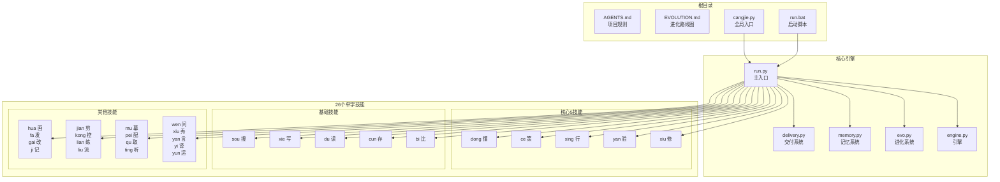

# 仓颉造字计划 - 思维导图


```mermaid
graph TB
    subgraph 根目录
        A[AGENTS.md<br/>项目规则] 
        B[EVOLUTION.md<br/>进化路线图]
        C[run.bat<br/>启动脚本]
        D[cangjie.py<br/>全局入口]
    end

    subgraph skills_dictionary[核心引擎]
        E[run.py<br/>主入口]
        F[delivery.py<br/>交付系统]
        G[memory.py<br/>记忆系统]
        H[evo.py<br/>进化系统]
        I[engine.py<br/>引擎]
    end

    subgraph characters[26个单字技能]
        subgraph 核心5技能
            J[dong 懂]
            K[ce 策]
            L[xing 行]
            M[yan 验]
            N[xiu 修]
        end

        subgraph 基础技能
            O[sou 搜]
            P[xie 写]
            Q[du 读]
            R[cun 存]
            S[bi 比]
        end

        subgraph 其他技能
            T[hua 画<br/>fa 发<br/>gai 改<br/>ji 记]
            U[jian 剪<br/>kong 控<br/>lian 练<br/>liu 流]
            V[mu 幕<br/>pei 配<br/>qu 取<br/>ting 听]
            W[wen 问<br/>xiu 秀<br/>yan 言<br/>yi 译<br/>yun 运]
        end
    end

    C --> E
    D --> E
    E --> F
    E --> G
    E --> H
    E --> I
    E --> J
    E --> K
    E --> L
    E --> M
    E --> N
    E --> O
    E --> P
    E --> Q
    E --> R
    E --> S
    E --> T
    E --> U
    E --> V
    E --> W
```

## 使用方式

```bash
cd skills/dictionary
python run.py 搜索Python
```

## 流程

```
用户 → dong懂 → ce策 → xing行 → yan验 → xiu修 → 结果
